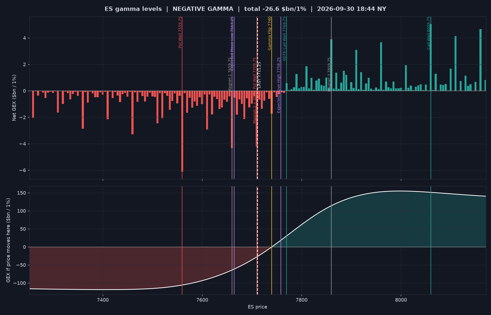

# GEX Levels for ES / NQ

Turns free CBOE option data into the dealer-gamma levels that paid services (SpotGamma, MenthorQ, ...) sell,
converted to **ES and NQ futures prices** so you can put them straight on your chart.

- ES levels come from SPX + SPY options, NQ levels from NDX + QQQ options.
- Fresh data every run, a price ladder with a "what to do today" playbook, a chart, a one-paste TradingView
  indicator, and a history log you can review to see if the levels actually worked.

<p align="center"></p>

## Setup (once)

```bash
pip install -r requirements.txt
```

## Daily routine

1. **Before the open** (after 08:00 New York time, when open interest is updated) run:
   ```bash
   python gex.py        # ES and NQ
   python gex.py ES     # only ES
   ```
2. Read the **REGIME** line and the price ladder (example below).
3. Copy the `TradingView` line into the indicator (see next section) - lines appear on your chart.
4. Trade the reactions at the levels using the playbook below.
5. Every couple of weeks run `python review.py` to see how price reacted to your levels.

Example output:

```
=== ES gamma levels (from SPX + SPY options) ===
Data: Wed 2026-09-30 18:45 New York (CBOE, 15-min delayed)
Basis ES - SPX: +59.79 (live, Wed 15:59 NY)
Total GEX: -26.61 $bn per 1% move

REGIME: NEGATIVE GAMMA (price below the Gamma Flip)
  Dealers AMPLIFY moves: expect bigger, faster swings and trends.
  - Don't fade strong moves blindly; trade breaks/retests with the trend.
  - Smaller size, wider stops. Walls can break instead of holding.
  - Reclaiming the Gamma Flip = market usually calms down.

  Level                            ES        SPX    Dist  Meaning
  Call Wall                   8059.75       8000    +348  Biggest resistance: rallies tend to stall or reject here
  Magnet 3                    7859.75       7800    +148  Price gets pulled here and often pins
  0DTE Call Wall              7769.75       7710     +58  Resistance for Thu Oct 01 (that day's expiry only)
  Expected Move High          7758.25    7698.54     +47  Top of the options-implied range for Thu Oct 01
  Gamma Flip                     7740    7680.33     +29  Regime line: above = calm/ranging, below = fast/trending
  >>> LAST PRICE              7711.25    7651.54       0  <<<
  Magnet 2 + 0DTE Put Wall    7709.75       7650      -2  Price gets pulled here and often pins | Support for ...
  Expected Move Low           7664.25    7604.54     -47  Bottom of the options-implied range for Thu Oct 01
  Magnet 1                    7659.75       7600     -52  Price gets pulled here and often pins
  Put Wall                    7559.75       7500    -152  Biggest support: if it breaks, selling can speed up
```

## TradingView setup

1. Open TradingView -> **Pine Editor** -> paste everything from `tradingview/gex_levels.pine` -> **Save** -> **Add to chart**.
2. Each day: indicator **Settings** -> paste the `TradingView` line printed by `gex.py`
   (the ES line on your ES chart, the NQ line on your NQ chart). Lines and labels are drawn automatically.

Colors: green = call walls (resistance), red = put walls (support), yellow = gamma flip,
purple dashed = expected move, gray dotted = magnets.

## How to trade the levels

Market makers (dealers) sell options to everyone else and hedge by trading the futures/index.
**How** they hedge depends on the gamma regime - that's the most important line in the report.

### 1. Check the regime first

| | Positive gamma (price above flip) | Negative gamma (price below flip) |
|---|---|---|
| Dealers | buy dips, sell rips | sell dips, buy rips |
| Market | calm, ranges, mean-reverts | fast, trends, big ranges |
| Your style | **fade** extremes at levels | **follow** breaks, don't catch knives |
| Size / stops | normal | smaller size, wider stops |

### 2. The levels

| Level | What it is | How to use it |
|---|---|---|
| **Gamma Flip** | Border between the two regimes | Break below = volatility can expand; reclaim above = market calms down |
| **Call Wall** | Strike with the most positive gamma | Resistance. First touch often rejects in positive gamma |
| **Put Wall** | Strike with the most negative gamma | Support. In negative gamma a break can accelerate selling |
| **0DTE Call / Put Wall** | Same, only today's expiry | Intraday resistance / support, strongest in the afternoon |
| **Magnets** | Big gamma strikes near price | Price gets pulled toward them and pins, especially near expiry |
| **Expected Move High / Low** | Range priced by today's ATM straddle | Most days close inside it. Outside = stretched, look for fades in positive gamma |

### 3. Simple setups (example rules - test them on replay/sim first)

- **Positive gamma fade:** price rallies into Call Wall / 0DTE Call Wall / Expected Move High ->
  wait for a rejection candle on the 5-minute chart -> short, stop a few points above the level,
  target the nearest magnet or the flip. Mirror it for longs at the Put Wall / Expected Move Low.
- **Negative gamma break:** price breaks the Put Wall or the flip with volume -> don't buy it.
  Wait for a retest from below that fails -> short with the trend, target the next level down.
  No clean retest = no trade.
- **Flip reclaim:** in negative gamma, price climbs back above the flip and holds 2-3 bars ->
  the selling pressure usually fades; look for longs toward magnets / call walls.

Rules that keep you alive: trade the **reaction** at a level, never the level blindly; always use a stop
beyond the level; risk a small fixed amount per trade (e.g. 1% of the account).

## Live alerts during the session

```bash
python track.py                 # ES and NQ from the 09:30 open
python track.py --start 08:25   # also the pre-market, e.g. on jobs-report days
```

After `gex.py` has run for the day, this checks ES/NQ every 2 minutes and prints a line when price
touches a level, when that level holds or breaks, and when price crosses the Gamma Flip (regime change).
A status line every 30 minutes shows where price is versus the flip. It stops at 16:00 ET.

## Review your levels

```bash
python review.py
```

Uses `history/levels_history.csv` (one row every time you run `gex.py`) and real ES/NQ prices to show,
per session: range vs expected move, whether each wall was touched and held or broke, and the close vs the flip.
The summary tells you whether negative-gamma days really are wilder for you - which is how you learn to trust
(or not trust) each level. yfinance keeps 5-minute bars for ~60 days, so review at least every month.

## Options

```
python gex.py ES --basis 59.5   # set ES - SPX yourself (if yfinance fails or you trade another contract month)
python gex.py --no-etf          # index options only (skip SPY / QQQ)
python gex.py --show            # open the chart when done
python gex.py --from-dir DIR    # use saved CBOE files DIR/_SPX.json etc. instead of downloading
python gex.py --no-history      # don't log this run
```

Files written: `output/ES_<date>.png` (chart), `output/ES_tradingview.txt`, `history/levels_history.csv`.

## How it works

- Options come from `cdn.cboe.com/api/global/delayed_quotes/options/{_SPX|SPY|_NDX|QQQ}.json` (15-min delayed).
- Gamma is recomputed with Black-Scholes from each option's implied volatility.
  GEX per option = gamma x open interest x multiplier x price^2 x 1%, calls positive, puts negative
  (standard assumption: dealers are long calls, short puts).
- SPY / QQQ options are scaled into SPX / NDX points keeping their dollar gamma.
- Walls use **net** GEX per strike so round strikes with huge offsetting call + put open interest
  (e.g. SPX 8000) don't count as both walls.
- Gamma flip = where the net GEX profile (recomputed at 201 prices within +-10%) crosses zero, nearest to price.
- Futures conversion: basis = futures - index from yfinance 1-minute bars (median of the last 15 shared minutes).

Limits: nobody outside the banks sees real dealer positions - this is an estimate from open interest.
Open interest updates once a day, so intraday 0DTE flow isn't in it. These are context levels, not signals.
Not financial advice.

## Development

```bash
python -m pytest
```

Code lives in `gex/` (`data`, `greeks`, `levels`, `futures`, `output`, `review`, `cli`).
The original 2022-2024 scripts are kept in `legacy/`.
