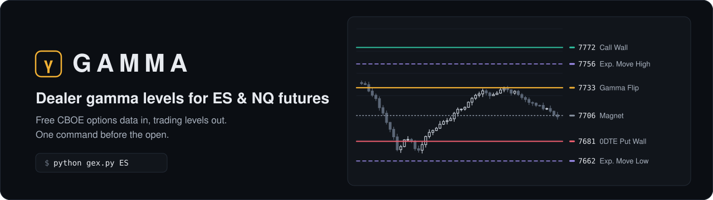
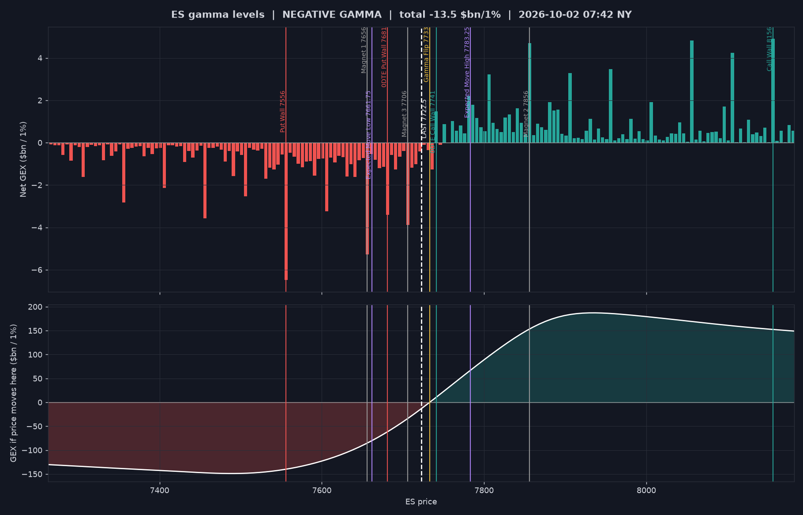
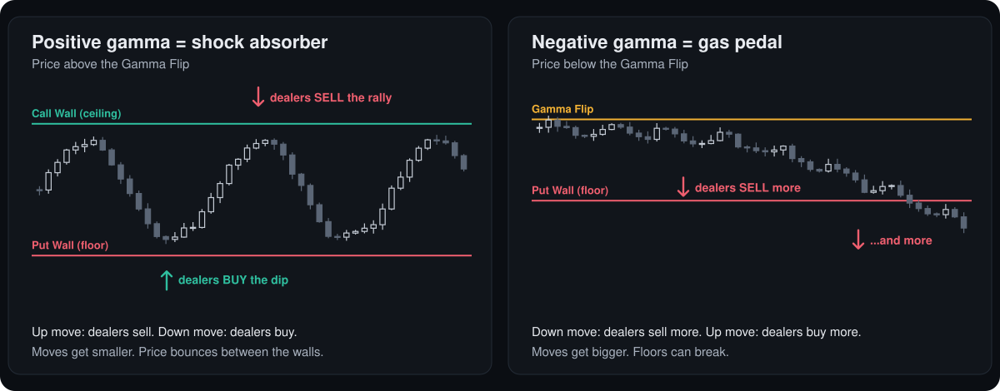
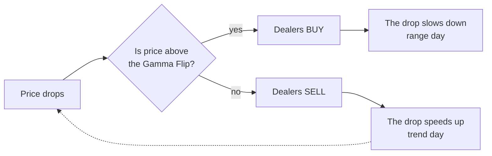
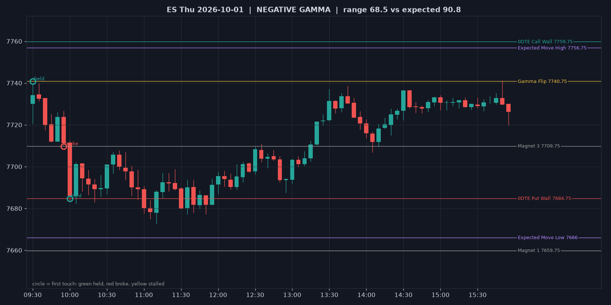
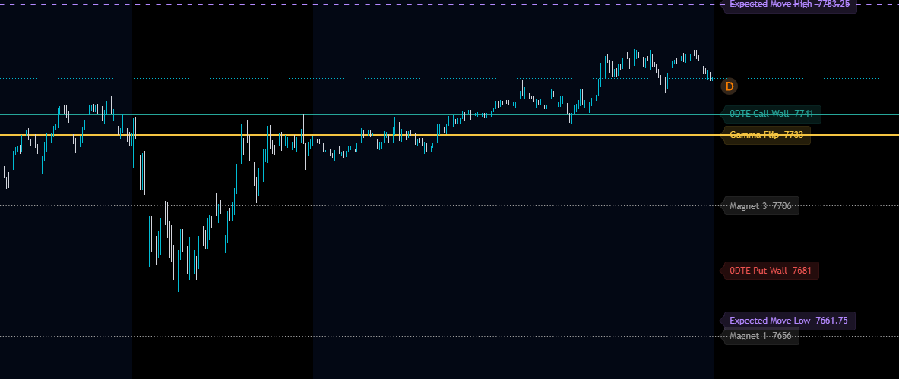
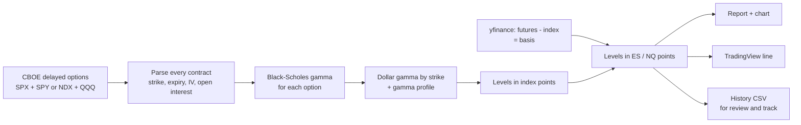

<p align="center">
  
</p>

<p align="center">
  
  
  
  
  <a href="LICENSE"></a>
</p>

<p align="center">
  <b>Where are the big options dealers forced to buy and sell today?</b><br>
  GAMMA answers that every morning for ES and NQ futures. Free data, one command.
</p>

<p align="center">
  <a href="#quick-start">Quick start</a> &middot;
  <a href="#gamma-explained-like-youre-15">Gamma explained</a> &middot;
  <a href="#the-levels">The levels</a> &middot;
  <a href="#a-real-day-october-1-2026">A real day</a> &middot;
  <a href="#tradingview-setup">TradingView</a> &middot;
  <a href="#commands">Commands</a> &middot;
  <a href="#faq">FAQ</a>
</p>

---

## What you get

| | |
|---|---|
| **Levels in futures prices** | Call Wall, Put Wall, Gamma Flip, Magnets, 0DTE walls and the expected move. They are computed from SPX + SPY (for ES) and NDX + QQQ (for NQ) options and converted to the futures price you actually trade. |
| **A plan, not just numbers** | Every report starts with the **regime**: is today likely calm or wild? Then it gives the rules that usually work in that regime. |
| **TradingView in one paste** | Install the included indicator once. Every morning, paste one line and all levels draw themselves. |
| **Live alerts** | `track.py` prints a line when price touches a level, when the level holds or breaks, and when price crosses the Gamma Flip. |
| **Proof, not hope** | `review.py` checks your saved levels against what really happened, so you learn which levels work for you. |

<p align="center">
  
</p>

---

## Quick start

```bash
git clone https://github.com/AyourElwazani97/gamma.git
cd gamma
pip install -r requirements.txt
python gex.py ES        # or NQ, or nothing for both
```

Real output from the morning of Friday, October 2, 2026:

```text
=== ES gamma levels (from SPX + SPY options) ===
Data: Fri 2026-10-02 07:42 New York (CBOE, 15-min delayed)
Basis ES - SPX: +56.05 (live, Thu 15:59 NY)
Total GEX: -13.53 $bn per 1% move

REGIME: NEGATIVE GAMMA (price below the Gamma Flip)
  Dealers AMPLIFY moves: expect bigger, faster swings and trends.
  - Don't fade strong moves blindly; trade breaks/retests with the trend.
  - Smaller size, wider stops. Walls can break instead of holding.
  - Reclaiming the Gamma Flip = market usually calms down.

  Level                      ES        SPX    Dist  Meaning
  Call Wall                8156       8100    +434  Biggest resistance: rallies tend to stall or reject here
  Magnet 2                 7856       7800    +134  Price gets pulled here and often pins
  Expected Move High    7783.25     7727.3     +61  Top of the options-implied range for Fri Oct 02
  0DTE Call Wall           7741       7685     +18  Resistance for Fri Oct 02 (that day's expiry only)
  Gamma Flip               7733    7676.93     +10  Regime line: above = calm/ranging, below = fast/trending
  >>> LAST PRICE         7722.5    7666.45       0  <<<
  Magnet 3                 7706       7650     -16  Price gets pulled here and often pins
  0DTE Put Wall            7681       7625     -42  Support for Fri Oct 02 (that day's expiry only)
  Expected Move Low     7661.75     7605.6     -61  Bottom of the options-implied range for Fri Oct 02
  Magnet 1                 7656       7600     -66  Price gets pulled here and often pins
  Put Wall                 7556       7500    -166  Biggest support: if it breaks, selling can speed up

TradingView (paste into the GEX Levels indicator settings):
8156=Call Wall;7856=Magnet 2;7783.25=Expected Move High;7741=0DTE Call Wall;7733=Gamma Flip;...
```

> [!TIP]
> Run it **before the open, after about 06:00 New York time**. Open interest (how many option contracts exist) is only updated once per night, so that is when the day's levels are ready.

---

## Gamma explained like you're 15

Forget the math for a minute. Here is the whole idea in five steps.

**1. Options are like insurance tickets.**
People buy **calls** (a bet that price goes up) and **puts** (protection in case price goes down). Millions of them exist on the S&P 500 and the Nasdaq every day.

**2. Someone has to sell those tickets: the dealers.**
Dealers (market makers) are like the shop that sells the tickets. They don't want to gamble on direction, they want the fee. So they **hedge**: they buy or sell futures to stay neutral, all day long.

**3. Gamma tells you how much hedging they must do when price moves.**
A strike with huge gamma is a price where dealers are forced to trade a lot. That's why price "feels" those strikes.

**4. The twist: depending on where price is, dealers either calm the market down or speed it up.**

<p align="center">
  
</p>

- **Positive gamma = shock absorber.** Price goes up, dealers sell. Price goes down, dealers buy. Like a goalkeeper who always kicks the ball back to the middle. Expect **ranges**.
- **Negative gamma = gas pedal.** Price goes down, dealers sell more, so it goes down even more. Like a snowball rolling downhill. Expect **trends and fast moves**.

**5. So the most important line of the day is the Gamma Flip**, the border between the calm zone and the wild zone.



> [!NOTE]
> Nobody outside the banks can see the dealers' real positions. GAMMA **estimates** them from public open interest, assuming dealers are long calls and short puts. Paid tools like SpotGamma and MenthorQ make the same kind of estimate.

---

## The levels

Colors match the TradingView indicator.

| Level | On the chart | Think of it as | What usually happens | How to use it |
|---|---|---|---|---|
| **Gamma Flip** | yellow, thick | The border between calm land and wild land | Above it: ranges. Below it: trends and fast moves | Check it first every day. Losing it means stop buying dips. Getting back above it means the market usually calms down. |
| **Call Wall** | green | The ceiling | Rallies stall or reject here, especially in positive gamma | Take profit on longs. Look for a short when price gets rejected. |
| **Put Wall** | red | The floor (a trampoline) | Price bounces. In negative gamma a break can drop like an elevator | Buy a **hold**, never a **break**. |
| **0DTE Call / Put Wall** | thin green / red | Today-only ceiling and floor | From options that expire at 16:00 today. Strongest during the day, especially in the afternoon | Intraday targets and fade spots. |
| **Magnets** | gray, dotted | Gravity | Price gets pulled toward them and often "pins" there into the close | Take profits there. Expect chop around them. |
| **Expected Move High / Low** | purple, dashed | The fence | The range option traders paid for today. Most days stay inside it | In positive gamma, fade the edges. In negative gamma, a break can run. |

**Two numbers on top of the report:**
- **Regime**: positive or negative gamma, which tells you whether to fade moves or follow them.
- **Total GEX**: how many billions of dollars dealers must trade for each 1% move. The bigger it is (positive or negative), the stronger the effect.

---

## A real day: October 1, 2026

The levels were printed at **05:58 New York time**, before the open. Here is how ES traded around them (5-minute candles; a circle marks the first touch of each level, green = held, red = broke):

<p align="center">
  
</p>

| Time (ET) | What happened | Level |
|---|---|---|
| 05:58 | The report says **negative gamma**, flip at 7740.75. Plan: don't buy dips, sell failed rallies. | Gamma Flip |
| 09:35 | The opening push stops at **7740.00**, 0.75 points under the flip. | Gamma Flip held |
| 10:00 | ES falls through the magnet at 7709.75 and reaches the **0DTE Put Wall at 7684.75**, then bounces 23 points. | Magnet broke, put wall held |
| 11:10 | Low of the day, 7672.75. | |
| 15:50 | The afternoon rally tops at **7741.25**, right at the flip again. | Gamma Flip held |

**The plan's trade:** short the failed retest of the flip at 7734.25, stop 7748.5. Both targets (7709.75, 7684.75) were hit by 10:00, for **+37 points (+2.6R)**. The NQ trade the same morning was a **loss (−1R)** because the entry came 59 points away from the level. Enter near the level or skip it.

> [!IMPORTANT]
> One good day proves nothing. Run `review.py` every week and build your own statistics before you trust any level with real money.

---

## Your daily routine

| New York time | Do this | Command |
|---|---|---|
| 06:00 to 09:00 | Get today's levels and read the regime | `python gex.py` |
| Before 09:30 | Paste the lines into TradingView | see [TradingView setup](#tradingview-setup) |
| 09:30 to 16:00 | Get alerts when price hits a level | `python track.py` |
| After 16:00 | See which levels held and which broke | `python review.py --detail --charts output/review` |

**Five rules that keep you alive**
1. **Trade the reaction, not the level.** Wait for price to touch it and show you a bounce or a break.
2. **Put your stop beyond the level.** If the level fails, you're out with a small loss.
3. **Enter near the level or skip.** A late entry means a huge stop.
4. **Size by risk (R), not by number of contracts.** Decide how many dollars you can lose per trade first, then pick the size.
5. **On news days (jobs report, CPI, Fed), wait 10 to 15 minutes** after the release before trading. Then watch which level stops the spike.

---

## TradingView setup

**Install once**
1. Open an **`ES1!`** chart (or `NQ1!`).
2. Open the **Pine Editor**, choose **Open → New indicator**, delete the template and paste the contents of [`tradingview/gex_levels.pine`](tradingview/gex_levels.pine).
3. Click **Save**, then **Add to chart**.

**Every morning**
1. Run `python gex.py` and copy the `TradingView` line (it's also saved in `output/ES_tradingview.txt`).
2. Click the **gear** next to *GEX Levels* on your chart, paste the line into **Levels**, click **OK**.

<p align="center">
  
</p>

| Color | Level |
|---|---|
| Green | Call walls |
| Red | Put walls |
| Yellow | Gamma Flip |
| Purple, dashed | Expected move |
| Gray, dotted | Magnets |

---

## Commands

<details>
<summary><b><code>gex.py</code></b>: today's levels, chart, TradingView line, history</summary>

```bash
python gex.py                   # ES and NQ
python gex.py ES                # one product
python gex.py ES --basis 59.5   # set the ES - SPX gap yourself (another contract month, or yfinance is down)
python gex.py --no-etf          # index options only (skip SPY / QQQ)
python gex.py --show            # open the chart when done
python gex.py --from-dir DIR    # use saved CBOE files (DIR/_SPX.json ...) instead of downloading
python gex.py --no-history      # don't log this run
```

Writes `output/ES_<date>.png`, `output/ES_tradingview.txt` and adds a row to `history/levels_history.csv`.
</details>

<details>
<summary><b><code>track.py</code></b>: live alerts during the session</summary>

```bash
python track.py                 # ES and NQ from the 09:30 open, checks every 2 minutes
python track.py --start 08:25   # include the pre-market (jobs report days)
python track.py ES --interval 60
```

Alerts from a replay of October 1, 2026:

```text
TRACKING ES, NQ from 09:30 ET, checking every 120s
09:30 ES touched Gamma Flip 7740.75 as resistance (last 7734.25)
09:30 NQ touched Magnet 3 30846.5 as resistance (last 30809.75)
ES Gamma Flip 7740.75 HELD: bounced 9.5 pts (last 7732.5)
NQ Magnet 3 30846.5 HELD: bounced 106 pts (last 30802.5)
09:45 NQ touched 0DTE Call Wall + Magnet 1 30726.5 as support (last 30708.5)
NQ 0DTE Call Wall + Magnet 1 30726.5 HELD: bounced 63.5 pts (last 30786)
09:55 ES touched Magnet 3 7709.75 as support (last 7711.25)
ES Magnet 3 7709.75 BROKE: went 26 pts through (last 7686)
10:00 ES touched 0DTE Put Wall 7684.75 as support (last 7686)
ES 0DTE Put Wall 7684.75 HELD: bounced 17.25 pts (last 7701.25)
```
</details>

<details>
<summary><b><code>review.py</code></b>: how did the levels do?</summary>

```bash
python review.py                                  # summary for ES and NQ
python review.py ES --detail                      # level-by-level reactions for each session
python review.py --detail --charts output/review  # plus a 5-minute chart per session
```

For every level it reports the first touch, whether it was tested as support or resistance, and whether price
**held** (moved 0.1% away) or **broke** (moved 0.1% through) within 60 minutes. It ends with a scorecard per level type.
yfinance keeps 5-minute bars for about 60 days, so review at least once a month.
</details>

---

## How it works



<details>
<summary>The math, for the curious</summary>

- **Dollar gamma per option** = gamma × open interest × contract multiplier × price² × 1%. Calls count positive, puts negative (dealers assumed long calls, short puts).
- **Gamma** is recomputed with Black-Scholes from each option's implied volatility. Rates and dividends are set to zero, and time to expiry has a 1-hour floor.
- **SPY / QQQ** options are scaled into SPX / NDX points: strike × ratio, multiplier ÷ ratio. That keeps each option's dollar gamma unchanged.
- **Call Wall / Put Wall** = the strikes with the most positive / most negative **net** gamma within ±15% of price. Net, because round strikes like SPX 8000 carry huge offsetting call and put open interest.
- **Gamma Flip** = where the total gamma, recomputed at 201 prices within ±10%, crosses zero (the crossing nearest to price).
- **Magnets** = the three biggest absolute-gamma strikes within ±2% of price.
- **Expected move** = price ± the at-the-money straddle of the nearest expiry.
- **Basis** = futures minus index, the median of the last 15 shared 1-minute bars.
</details>

---

## Limits

> [!WARNING]
> - These are **estimates** from public data, not the dealers' real books.
> - Open interest updates **once per day**. Today's new 0DTE positions are not in it.
> - CBOE data is **15 minutes delayed**.
> - The report uses the last index close for the regime. Before the open, compare the **live** futures price with the Gamma Flip yourself.
> - Levels are context, not buy/sell signals. All example trades are hypothetical replays.
> - **Nothing here is financial advice.** Futures can lose more than you put in.

---

## FAQ

<details>
<summary><b>Why are my levels different from SpotGamma or MenthorQ?</b></summary>

Every service uses its own assumptions: which options are included, how dealers are positioned, how walls are defined. Expect similar areas, not identical numbers. The levels that matter most (big round strikes, the flip area) usually line up.
</details>

<details>
<summary><b>The report says negative gamma, but price is above the flip. Which is right?</b></summary>

Trust the live price. The regime line in the report is computed at the last index close. If futures traded overnight and are now above the Gamma Flip, the market is in positive gamma.
</details>

<details>
<summary><b>What is the "basis"?</b></summary>

ES and SPX don't trade at the same price. ES is usually a bit higher because of interest rates and dividends. GAMMA measures that gap (for example +56 points) and adds it to every level, so the levels match your ES chart. If you trade a different contract month, set it yourself with `--basis`.
</details>

<details>
<summary><b>Does it work on weekends?</b></summary>

Yes. It uses Friday's data, and the 0DTE levels are for Monday's expiry.
</details>

<details>
<summary><b>Can I use it for SPY, QQQ or single stocks?</b></summary>

Not yet. Products are defined in `gex/config.py`, so adding one means a new entry with its option tickers and futures symbol.
</details>

---

## Project structure

```text
gex.py              today's levels           ->  gex/cli.py
track.py            live alerts              ->  gex/track.py
review.py           how did the levels do?   ->  gex/review.py
gex/
  config.py         products (ES, NQ)
  data.py           download + parse CBOE option chains
  greeks.py         Black-Scholes gamma
  levels.py         walls, flip, magnets, expected move
  futures.py        index -> futures basis
  reactions.py      held / broke / stalled at each level
  output.py         report, chart, TradingView line, history CSV
tradingview/        GEX Levels indicator (Pine Script v6)
history/            your daily levels log
tests/              66 tests (python -m pytest)
legacy/             the original 2022-2024 scripts
```

**Run the tests**

```bash
python -m pytest
```

Contributions are welcome. Open an issue first for bigger changes, and keep tests passing.

---

## License

[MIT](LICENSE): free to use, change and share. The software comes with no warranty, and nothing in it is financial advice.
